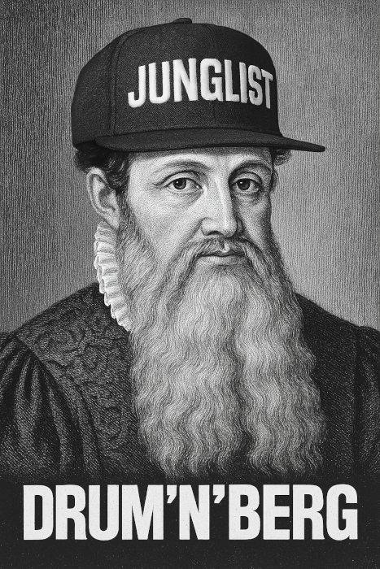

# Drum'n'Berg

A drum machine block for WordPress.

[See a demo using WordPress Playground](https://playground.wordpress.net/#eyIkc2NoZW1hIjoiaHR0cHM6Ly9wbGF5Z3JvdW5kLndvcmRwcmVzcy5uZXQvYmx1ZXByaW50LXNjaGVtYS5qc29uIiwibGFuZGluZ1BhZ2UiOiIvP3A9NCIsImxvZ2luIjp0cnVlLCJzdGVwcyI6W3sic3RlcCI6Imluc3RhbGxQbHVnaW4iLCJwbHVnaW5EYXRhIjp7InJlc291cmNlIjoidXJsIiwidXJsIjoiaHR0cHM6Ly9naXRodWItcHJveHkuY29tL3Byb3h5Lz9yZXBvPXdhY2xhd2phY2VrL2RydW0tbi1iZXJnJnJlbGVhc2U9MC4xLjAmYXNzZXQ9ZHJ1bS1uLWJlcmcuemlwIn19LHsic3RlcCI6IndyaXRlRmlsZSIsInBhdGgiOiIvd29yZHByZXNzL3dwLWNvbnRlbnQvcG9zdGNvbnRlbnQubWQiLCJkYXRhIjp7InJlc291cmNlIjoidXJsIiwidXJsIjoiaHR0cHM6Ly9yYXcuZ2l0aHVidXNlcmNvbnRlbnQuY29tL3dhY2xhd2phY2VrL2RydW0tbi1iZXJnL21haW4vYXNzZXRzL2RlbW8tcG9zdC1jb250ZW50Lm1kIn19LHsic3RlcCI6InJ1blBIUCIsImNvZGUiOiI8P3BocCByZXF1aXJlX29uY2UgJ3dvcmRwcmVzcy93cC1sb2FkLnBocCc7ICRwb3N0X2NvbnRlbnQgPSBhZGRzbGFzaGVzKCBmaWxlX2dldF9jb250ZW50cyggJy93b3JkcHJlc3Mvd3AtY29udGVudC9wb3N0Y29udGVudC5tZCcgKSApOyB3cF9pbnNlcnRfcG9zdChhcnJheSgncG9zdF90aXRsZScgPT4gJ0RydW1cXCduXFwnQmVyZyBTYW1wbGUgQmVhdCcsICdwb3N0X2NvbnRlbnQnICA9PiAkcG9zdF9jb250ZW50LCAncG9zdF9hdXRob3InICAgPT4gMSwgJ3Bvc3Rfc3RhdHVzJyA9PiAncHVibGlzaCcpKTsgPz4ifV0sInByZWZlcnJlZFZlcnNpb25zIjp7InBocCI6IjguMCIsIndwIjoibGF0ZXN0In0sImZlYXR1cmVzIjp7fX0=)

## What is Drum'n'Berg?

Drum'n'Berg is for you if you:

- Are selling audio sample packs online.
- Want to add an audio surprise to your blog.
- Are bored when writing a long article and want to lay down a sick beat.

## What can it do?

Add as many tracks as you want, upload your samples of choice, program the beat you want and listen to it from within the WordPress block editor.

If you publish your post, visitors will be able to listen to your production and even play with it, but not change the tracks or BPM.

## Where can I find audio samples?

Drum'n'Berg comes with demo samples that can be found in the `assets/samples` directory.

You can find more public copyright licensed samples online, including on sites like:

- [Citizen DJ](https://citizen-dj.labs.loc.gov/)
  > Make music using the free-to-use audio and video materials from the Library of Congress
- [freesound](https://freesound.org/)
  > Freesound aims to create a huge collaborative database of audio snippets, samples, recordings, and all sorts of bleeps, ... released under Creative Commons licenses that allow their reuse.

## How is this project structured

### Registered blocks

The plugin registers two Gutenberg blocks:

- the drum machine: `drum-n-berg/drum-machine`,
- a drum machine track: `drum-n-berg/track`.

The drum machine block is the main block and is the only one available from a post context.

The track block can only be added within a drum machine block.

### Conventions

The project uses

- TypeScript
- SASS (BEM methodology)

## Known issues

For a list of known issues, please visit [the Issues tab](https://github.com/waclawjacek/drum-n-berg/issues?q=sort%3Aupdated-desc+is%3Aissue+is%3Aopen) of this repository.

## Acknowledgements

- [howler.js](https://howlerjs.com/) - Audio library for the modern web.
